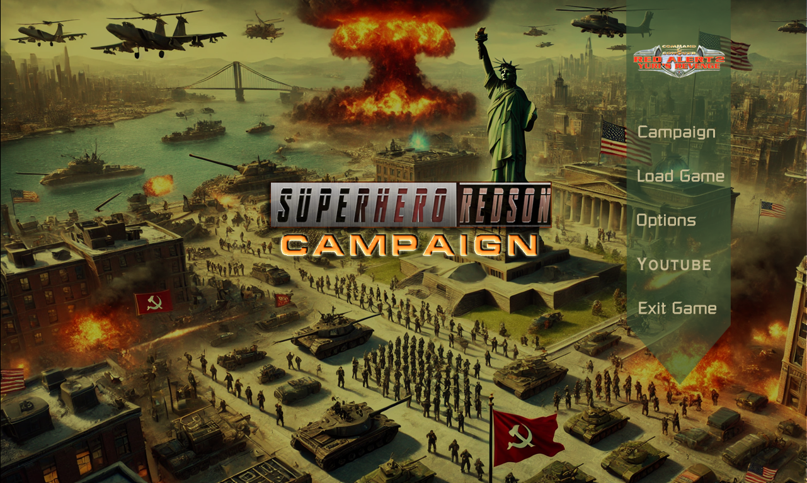
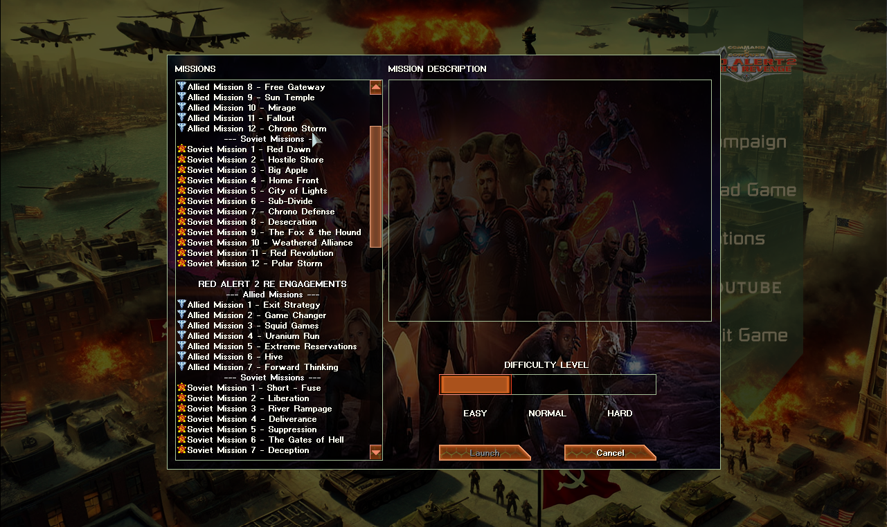

- Client được tách biệt so với bản Skirnish
  
- Client build từ CNC Mod Base, giúp trải nghiệm mượt mà hơn
  
- Các Siêu Anh Hùng & Siêu Ác Nhân được giảm sức mạnh cho phù hợp hơn với hệ thống nhiệm vụ
  
- Mỗi nhiệm vụ đều có cốt truyện và hướng dẫn, vui lòng xem qua trước khi bắt đầu chiến dịch.
  
- Ngoài việc đem phục dựng lại 2 chuỗi nhiệm vụ gốc RedAlert2, fix lỗi nhiệm vụ Yuri, Mod còn thêm vô các chuỗi nhiệm vụ mới tăng tính trải nghiệm & giải trí cho người chơi.
  
- Hiệu ứng cháy nổ & công trình đều dùng lại nguồn từ bản Skirnish.
  
- Khi có bất cứ vấn đề nào về nhiệm vụ cụ thể, vui lòng liên hệ tác giả để được trợ giúp.

GIAO DIỆN CHÍNH

  

     <!-- Thêm khoảng trống -->

GIAO DIỆN CAMPAIGN

  

